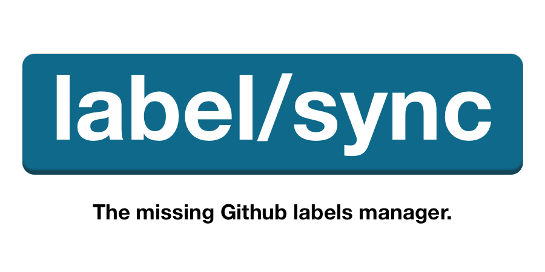

<div align="center">

<a href="label-sync.com"></a>

</div>

[](https://circleci.com/gh/maticzav/label-sync/tree/master)
[](https://codecov.io/gh/maticzav/label-sync)
[](https://badge.fury.io/js/label-sync)

> Managing multiple repositories is hard. LabelSync helps you manage labels across your repository fleet.

## Why LabelSync?

While working at Prisma, I discovered that many companies struggle with repository organisation. In particular, companies struggle with managing labels across multiple repositories in their organisation.

My vision is to develop the best in class software that would help companies triage issues and pull requests, and simplify the use of labels.

## How LabelSync works?

Label Sync helps you sync Github labels across multiple repositories:

- _Manage_: **Handle multiple repositories from a central configuration.**
- _Restrict_: **Prevent adding new labels that don't fit into your workflow.**
- _Simplify_: **Simplify your triaging by selectivly picking labels.**.

## Getting Starterd

1. Start by installing the [LabelSync Manager Github Application](https://label-sync.com/manager). We recommend you install it across your entire fleet - LabelSync won't modify repositories that you haven't configured.

2. LabelSync Manager created a `<org>-labelsync` repository for you, where `<org>` represents the name of your organisation or account.
   That's where your configuration resides. We've included the labels and repository configurations that we found most useful and encourage you to use them as your starting point.

## Configuring LabelSync

We configure all repositories that LabelSync manager from a single repository. LabelSync Manager already created that repository for you during installation.

LabelSync comes with a utility library `label-sync` that allows you to leverage the power of TypeScript to compose configuration for your fleet. We encourage you to use the library.

Alternatively, you can write `labelsync.yml` configuration manually.

#### Using TypeScript utility library

`label-sync` library comes pre-packed in your configuration repository. It exposes three main constructors: `configuration`, `repository`, and `label`.

We've already included some of them in your starting template. To add new ones follow these guidelines:

```ts
function configuration({
  /* Repositories represent a repo-name:config dictionary */
  repositories: Dict<Repository>
}): Configuration

function repository({
  /* Strict option determines whether LabelSync should allow additional labels or limit available ones to your configuration */
  strict?: boolean,
  /* Represents dictionary of label-name:config configurations */
  labels: Dict<Label>
})

function label(
  /* Label Color */
  string |
  /* Full blown Label configuration */
  { color: string
  , description: string
  }
)
```

> NOTE: Setting strict to `true` will delete unconfigured labels.

You can reuse `label` and `repository` configurations anywhere in your configuration file.

In the end, LabelSync still relies on `labelsync.yml` file. To generate it, run `make`.

```ts
import { configuration, repository, label, make } from 'label-sync'

const bug = label('#ff32bb')
const question = label('#c5def5')

/* Setup repository configuration */
const labelSync = repository({
  strict: true,
  lablels: {
    'kind/bug': bug,
    'kind/question': question,
  },
})

/* Setup LabelSync configuration */
const config = configuration({
  repositories: {
    'label-sync': standard,
  },
})

/* Generates the configuration file. */
make({
  configs: [config],
})
```

#### Manually configuring LabelSync using YAML file

To configure LabelSync using YAML file, create `labelsync.yml` file in the root of your configuration repository.

```yml
repos:
  graphql-shield:
    strict: true
    labels:
      kind/bug:
        color: ff3311
      kind/question:
        color: '#c5def5'
      stale:
        color: ff69b4
        description: Label indicating Stale issue.
```

## F.A.Q

#### Is LabelSync free?

LabelSync will remain free while in beta.

#### I have a problem but don't know who to ask.

Please open up an issue describing your problem, or send us an email to <a href="mailto:support@label-sync.com">support@label-sync.com</a>.

#### I have an idea/problem that LabelSync could solve.

Please reach out to <a href="mailto:matic@label-sync.com">matic@label-sync.com</a>. I'd be more than happy to chat about LabelSync with you!

## License

BSD 3-Clause, see the [LICENSE](./LICENSE) file.
