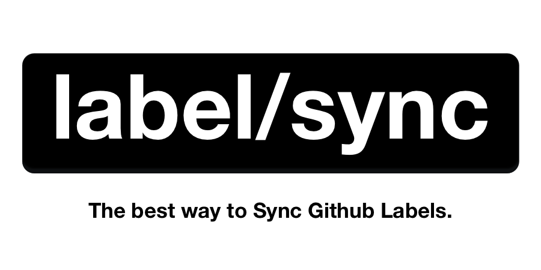

<div align="center">

<a href="label-sync.com"></a>

</div>

[](https://circleci.com/gh/maticzav/label-sync/tree/master)
[](https://codecov.io/gh/maticzav/label-sync)
[](https://badge.fury.io/js/label-sync)

> Managing multiple repositories is hard. LabelSync helps you manage labels across your repository fleet.

## Why LabelSync?

While working at Prisma, I discovered that many companies struggle with repository organisation. In particular, companies struggle with managing labels across multiple repositories in their organisation.

My vision is to develop the best in class software that would help companies triage issues and pull requests, and simplify the use of labels.

## Features and Quirks of LabelSync

Label Sync helps you sync Github labels across multiple repositories:

- 🛰 **Centralised management**: Handle multiple repositories from a central configuration.
- 👮 **Restricts unconfigured labels**: Prevent adding new labels that don't fit into your workflow.
- 🐣 **Aliases**: Quickly rename old labels to a new label.
- 🎢 **Siblings**: Create workflows with labels.

## Getting Starterd

**Personal accounts:**

1. Start by scallfolding your configuration by running

```bash
yarn create label-sync
npm init label-sync
```

2. Follow the guide in README.

3. Support the project by sponsoring me on Github. I've put a lot of effort into making this bot and I'd love to keep it free to use in the future. Thank you for [sponsoring](https://github.com/sponsors/maticzav) me! :heart:

**Organisations:**

1. Start by installing the [LabelSync Manager Github Application](https://github.com/apps/labelsync-manager). I recommend you start by installing it on a small selection of repositories - LabelSync will scaffold a getting started configuration for you based on your selection. (Nothing will be changed at that point though.)
2. LabelSync Manager created a `<org>-labelsync` repository for you, where `<org>` represents the name of your organisation or account.
   That's where your configuration resides. We've included the labels and repository configurations that we found most useful and encourage you to use them as your starting point.

3. Support the project by sponsoring me on Github. I've put a lot of effort into making this bot and I'd love to keep it free to use in the future. Thank you for [sponsoring](https://github.com/sponsors/maticzav) me! :heart:

> :construction: NOTE: It seems like scaffolding for personal accounts doesn't work as expected due to some Github Application endpoint limitations. If you can help, please comment in the [issue](https://github.com/maticzav/label-sync/issues/208).

## Configuring LabelSync

We configure all repositories that LabelSync manager from a single repository. LabelSync Manager already created that repository for you during installation. In that repository, there's a file `labelsync.yml`. Whenever you change it, Label Sync is going to try to sync labels across your organisation.

In the end, Label Sync only cares about that `labelsync.yml` file. However, to make configuration more approachable, I've created helper packages that allow you to use the power of your prefered language and generate `labelsync.yml` using a library.

You may configureusing:

- **YAML**
- **TypeScript**
- **Python** (coming soon)
- **Go** (coming soon)

Check the docs below for documentation on how to do it.

### LabelSync configuration libraries

#### YAML

Create a `repos` object at the root of the file and nest names of the repositories inside.

Each repository accepts two properties:

- an optional `config` parameter that tells LabelSync how to sync that particular repository. Set `removeUnconfiguredLabels` to `true` to, well, remove all unconfigured labels.
- an object of labels

Each label accepts:

- `color` property in HEX format (with or without "#"),
- an optional `description`
- an `alias` property that accepts a list of labels that LabelSync should rename to the new label.
- `siblings` that tell LabelSync which labels it should add to the issue or pull request additionally when a particular label is assigned to it. All `siblings`, however, need to be configured - you cannot reference a "third-party" label.

```yml
repos:
  graphql-shield:
    config:
      removeUnconfiguredLabels: true
    labels:
      kind/bug:
        color: ff3311
      bug/0-needs-reproduction:
        color: ff3311
        siblings: ['kind/bug'] # when you add "bug/0-needs-reproduction" to issue LabelSync will add "kind/bug" as well.
      kind/question:
        color: '#c5def5'
        alias: ['question'] # we'll rename "question" label to "kind/question".
      stale:
        color: ff69b4
        description: Label indicating Stale issue.
```

#### TypeScript

TypeScript helper library let's you use the power of TypeScript to configure your labels. It exposes three main constructors: `labelsync`, `repo`, and `label`.

We recommend you start with the getting started TypeScript template using `create-label-sync` package.

Run `yarn create label-sync` or `npm init label-sync` to get started. Follow the guide there!

**Methods:**

- `labelsync`: used as a configuration entry point. Outputs yaml version of your configuration to the root of your repository.
- `repo`: used to configure a single repository
- `label`: used to create a single label

**Presets:**

Check out `colors` property with a set of common colors for labels, and `type`, `note`, `impact`, `effort`, `needs`, `scope` and `communtiy` label templates to get up to speed more quickly. Label templates all prepend their name to the name of your label and already pack a nice color of our choosing.

**API:**

```ts
function labelsync({
  /* Repositories represent a repo-name:config dictionary */
  repos: { [repo: string]: Repository }
}): Configuration

/* Repo */
function repo({
  config?: {
    /* removes unconfigured labels from repository to keep it clean */
    removeUnconfiguredLabels?: boolean
  }
  /* list of labels that we get using label method below */
  labels: Label[]
})

/* Label */
function label(name: string, color: string)
function label({
  /* name of the label */
  name: string
  /* color in hex format */
  color: string
  description?: string
  /* old names of this label */
  alias?: string[]
  /* siblings of the label */
  siblings?: string[]
})
```

> NOTE: Setting strict to `true` will delete unconfigured labels.

You can reuse `label` and `repo` configurations anywhere in your configuration file.

In the end, LabelSync still relies on `labelsync.yml` file. To generate it, run `labelsync` method.

```ts
import { labelsync, repo, label, colors } from 'label-sync'

/* Setup LabelSync configuration */
labelsync({
  github: repo({
    config: {
      removeUnconfiguredLabels: false,
    },
    labels: [
      label({
        name: 'kind/bug',
        color: '#d73a4a',
        description: "Something isn't working",
        alias: ['bug'],
      }),
      label({
        name: 'bug/has-reproduction',
        color: '#d73a4a',
        description: 'Bug with reproduction',
        siblings: ['kind/bug'],
      }),
      label({
        name: 'documentation',
        color: '#0075ca',
        description: 'Improvements or additions to documentation',
      }),
    ],
  }),
})
```

## F.A.Q

#### Is LabelSync free?

LabelSync will remain free while in beta.

#### I have a problem but don't know who to ask.

Please open up an issue describing your problem, or send us an email to <a href="mailto:support@label-sync.com">support@label-sync.com</a>.

#### I have an idea/problem that LabelSync could solve.

Please reach out to <a href="mailto:matic@label-sync.com">matic@label-sync.com</a>. I'd be more than happy to chat about LabelSync with you!

## License

BSD 3-Clause, see the [LICENSE](./LICENSE) file.
