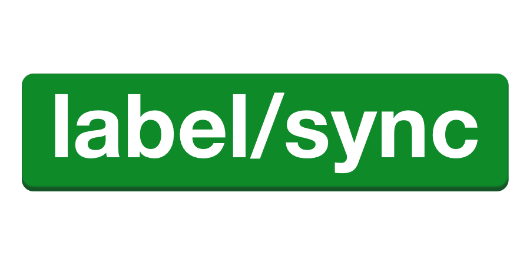

<p align="center"></p>

# label-sync

[](https://circleci.com/gh/maticzav/label-sync/tree/master)
[](https://coveralls.io/github/maticzav/label-sync?branch=master)
[](https://badge.fury.io/js/label-sync)

> A delightful companion to manage Github Labels across multiple repositories.

## Overview

Label Sync helps you sync Github labels accross multiple repositories. Using an intuitive API you'll be able to customize repository configuration across all your projects in no time. Besides that, it also features a core package module which can be used to build highly customised workflows.

## Features

- ✂️ **Flexible:** Compatible with JS, TS and JSON configuration.
- 🌈 **Easy to use:** Simply use one of the templates to start!
- 🐶 **Friendly error messages:** Guides you through installation and sync, no magic involved!
- 🌳 **Perfect test coverage:** Maintaining 100% test coverage.
- 💪 **Used by giants:** Used in production by companies like [@prisma](https://prisma.io) or [@graphcms](https://graphcms.com)

## Installation

```bash
npm init label-sync
```

I suggest you use one of the prebuilt configurations as a starting point of your project. You can find more about the templates in the (\examples)[https://github.com/maticzav/label-sync/tree/master/examples] folder.

## Configuration

Besides using the core package and building the worklow on your own, you can use a set of preused builders which support JS, JSON and TS configuration options.

### `JSON`

JSON is the most opinionated option and the quickest to setup.

```json
{
  "strict": false,
  "labels": {
    "FAQ": {
      "color": "purple",
      "description": "Frequently asked questions"
    }
  },
  "repositories": ["maticzav/*"],
  "publish": {
    "branch": "master"
  }
}
```

### `JavaScript`

JavaScript

```js
const shield = require('./config/graphql-shield.js')

module.exports = {
  'maticzav/graphql-shield': shield,
  'maticzav/label-sync': {
    labels: {
      bug: 'blue',
      'kind/kudos': {
        description: 'Issues which simply thank for the project.',
        color: 'red',
      },
    },
    strict: true,
  },
}
```

### `TypeScript`

TypeScript

```ts
import { Config } from 'label-sync-core'
import { prismaBinding } from './repositories/prisma-binding'
import { graphqlYoga } from './repositories/graphql-yoga'

const config: Config = {
  'prisma/prisma-binding': prismaBinding,
  'prisma/graphql-yoga': {
    labels: {
      bug: 'blue',
      'kind/kudos': {
        description: 'Issues which simply thank for the project.',
        color: 'red',
      },
    },
    strict: false,
  },
}

export default config
```

## Advanced

## License

MIT @ Matic Zavadlal
